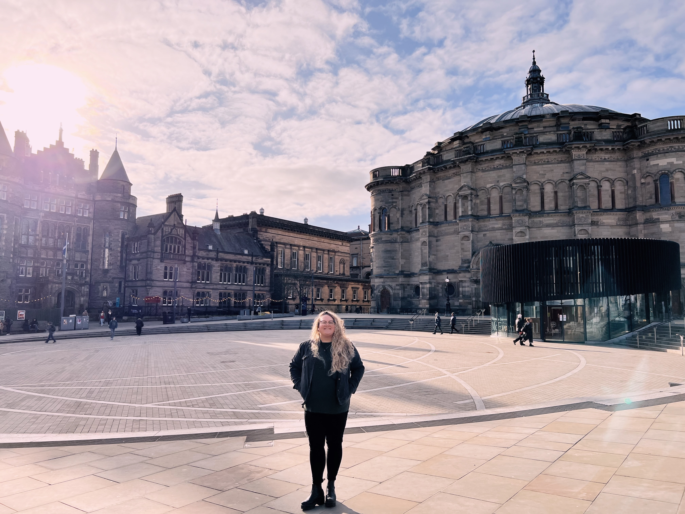
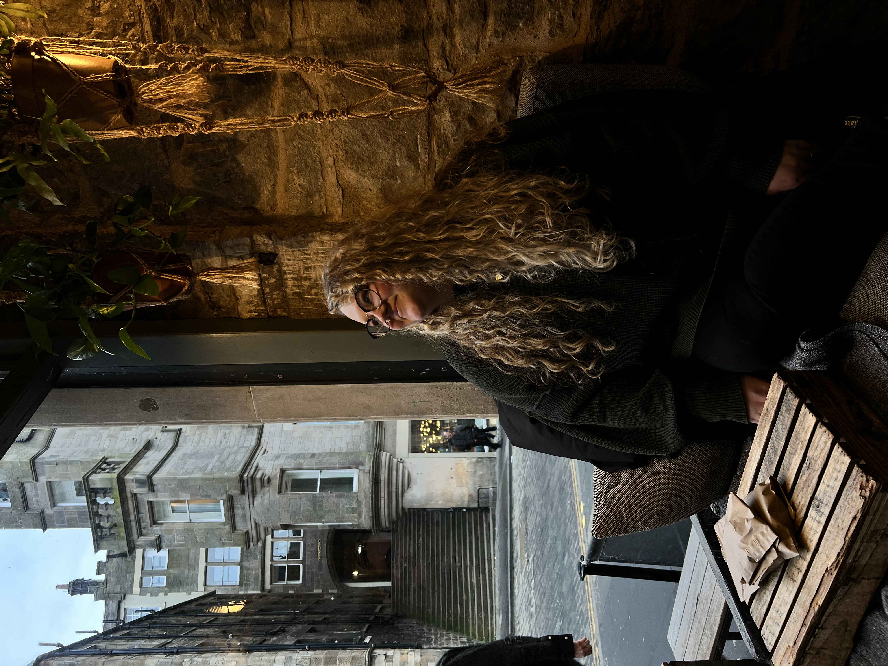
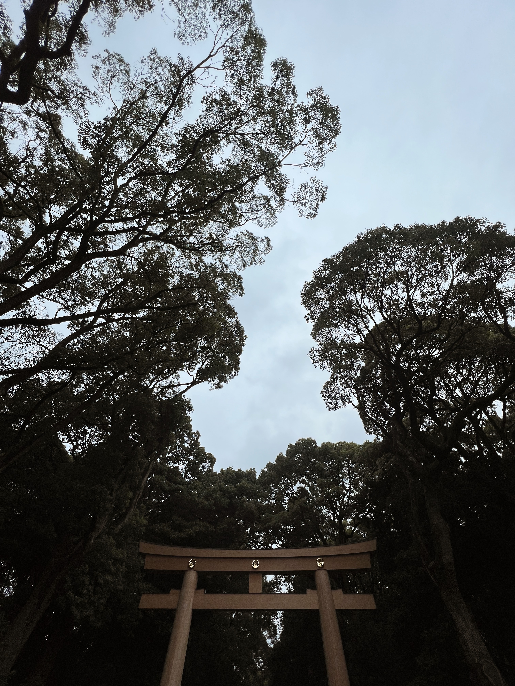

## Feel free to connect with me on [LinkedIn](https://www.linkedin.com/in/caitlin-schaeffer-125668153) !
## Visit my contact card here: [Contact card](https://caitlinschaef.github.io/contact.html)

## Week of April 1, 2024 - Sprint 1
### What is the number one thing that held you back this week? Why?
#### I think that the only thing holding me back right now is my limited scope of knowledge. I started coding 5 weeks ago, at the beginning of March 2024. Being in the 5th week of the program encompasses the full range of my knowledge. 

### What is one thing you would like to learn more about regarding JavaScript (JSON, Data Structures), Bootstrap, or Atomic Design?
#### I think that I would like to learn more functions of JavaScript, and continue to refine my understanding of functions, variables, and other components. 

### What is your “Why”?
#### My 'why' is developing a career in a field I'm interested in, that will allow me to live the kind of life I find fulfilling. 

## Week of March 25, 2024
### What was helpful during Onboarding working remotely?
#### I think the program being more flexible while we're going through a lot of information is helpful, so that we can read and participate as we are able.

### What hindered your progress during Onboarding?
#### Working my job as a teacher while Onboarding was going on was most definitely challenging thing. 

### How did you overcome challenges during Onboarding?
#### Trying to be cognizant of timing and timelines, doing things again and again, and eventually learning when to ask for help. 

## Week of March 18, 2024
### What are your thoughts about the roles HTML, CSS, and JavaScript play in the process of rendering content and providing a user experience?
#### I think that I'm starting to see how everything comes together, which makes it less scary. Coming in with no real coding experience means that there was just oceans of information. There're still oceans but I think I could name at least one now.

### What are some objects that your blog incorporates?
#### My blog incorporates pictures (which I think would be considered objects?). This question honestly confuses me a little, as our blogs so far don't have any javascript aspects. 

## Week of March 11, 2024
### What is something you wish you could do but currently do not have the coding skills to accomplish?
#### I would really like to be better able to organize a website. Making it have a great user experience and good flow would be fantastic. I am going to practice by restructuring this blog!

### What are you struggling with?
#### Right now I'm struggling with finding the balance amongst things, there is just a lot happening all at once with teaching, starting this program, and a general busy season of life. I keep thinking about how nice it will be in 6 months, when I will hopefully have a job and focus on that exclusively.

### How do you solve a problem? 
#### I tend to really hammer at something until I understand what's happening, almost too much. 

### What methods do you use to help yourself get unstuck?
#### I think the best method for getting unstuck is to try and broaden the scope of what you're looking at. Often, problems are symptomatic of a breakdown somewhere else, so it is good to try and think of the bigger picture. 

## Week of March 4, 2024
### Was your first week what you expected? Why? Why not?
##### The first week of bootcamp exceeded my expectations in both workload and excitement. We dove right in to an ocean of material! 
### What are you excited or eager to learn more about?
##### I am excited to learn more about back end development, as it is honestly the part of web development that is a bit scary to me. 
### What is something about you that can only be learned by reading this blog?
##### I would say that I am much nerdier than I may appear, and it often surprises people. I'm a big fan of things like:
*   Video games (Play Station, Nintendo Switch, XBox, etc.)
*   Anime (I'm up to date on One Piece, and I like shonen shows, but also love a nice slice-of-life show, my favorite at the moment is The Apothecary Diaries {think lady Sherlock Holmes set in something like a pre-feudal Japan}).
*   Novels (I recommend *The Poppy Wars*, the *Red Rising* series, and also classical works like The Odyssey).
*   DnD (I've even been a DM, ✨dungeon master✨, for a few campaigns).

#### Most of all, I love traveling and experiencing new cultures (and learning their languages). 

### Please enjoy a few pictures from the two countries I visited last year in 2023, Scotland and Japan (including one picture of Mount Fuji on a clear day!):

